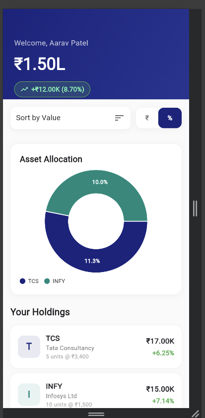

# finview_lite

A lightweight Flutter app for viewing financial data. It allows users to visualize their investments, asset allocation, and returns using mock data.

## Quick Links
- Repo path: c:\Users\trush\OneDrive\Desktop\Flutter project\finview_lite
- Main entry: lib/main.dart

## Setup (Windows)
1. Install Flutter (stable). Verify:
   - flutter --version
   - flutter doctor
2. From project folder:
   - cd "c:\Users\trush\OneDrive\Desktop\Flutter project\finview_lite"
   - flutter pub get

Recommended minimum: Flutter stable (run flutter --version to confirm). If needed:
   - flutter upgrade

## Dependencies
Open pubspec.yaml for the exact package list. Common packages used in this project (update as needed):
- flutter
- provider (or your state management)
- http or dio
- shared_preferences
- flutter_svg

To install/update:
- flutter pub get

## How to run
- Run on connected device or emulator:
  - flutter devices
  - flutter run
- Run on a specific device:
  - flutter run -d <device-id>
- Build release APK:
  - flutter build apk --release

## Project structure
- lib/
  - main.dart — app entry
  - screens/ — UI screens
  - widgets/ — reusable widgets
  - models/ — data models
  - services/ — API and data logic
- assets/ — images, icons, fonts
- test/ — unit & widget tests
- pubspec.yaml — dependencies & assets

## UI / Screenshot
Short description:
- Home: list of tracked instruments with price, change, and small sparkline.
- Detail: full chart, recent trades, and Buy / Sell actions (lightweight view).
- Search: quick instrument lookup with favorites.

Add screenshots to assets/screenshots/ and reference here:

## Demonstration / Screen recording
Replace with your recording link:
- Demo (screen recording): https://drive.google.com/file/d/1uhP1OvD_eefl8_-lj6lhZxhJUmRKizGi/view?usp=sharing

## What I did (summary you can paste)
- Created Flutter project scaffold
- Implemented core screens: home, detail, search
- Added basic state management and API service
- Included assets and placeholder screenshots
- Configured pubspec.yaml with required packages

If you want a generated changelog of every commit, run:
- git log --oneline

## Testing
- Run tests:
  - flutter test
- And also using Chrome browser